# Antares 当前架构分析与设计说明

> 文档状态：基于当前实现的架构基线（As-Is）与演进建议（To-Be）  
> 分析日期：2026-07-29  
> 代码基线：`main` / `e83bca04ef17cfd5f171344bb73e2af1400170c5`  
> 工程版本：`0.0.1`

## 1. 文档目的与范围

本文从源码、构建脚本、协议定义和部署清单四个层面说明 Antares 的当前架构，重点回答以下问题：

1. 系统由哪些进程、模块和 Actor 构成，各自边界是什么；
2. 客户端请求如何经过接入、路由、分片 Actor 和持久化层；
3. 配置、协议、热补丁、脚本、战斗服务和运维控制面如何协作；
4. 当前实现具备哪些扩展能力，距离生产可用还存在哪些缺口；
5. 新业务应放在哪一层，避免破坏 Actor 的一致性边界。

本文描述的是仓库中的实际实现，不把 README 中的愿景当成已完成能力。文中“当前实现”与“建议方案”会明确分开。

## 2. 架构摘要

Antares 是一个面向长连接在线游戏的多进程服务端脚手架。JVM 集群是业务控制面和持久化主体，核心由 Kotlin、Asteria 和 Apache Pekko Cluster 构成；Rust `battle` 服务承接低延迟战斗数据面；ZooKeeper 同时承担运行时配置中心、开发拓扑存储、Worker ID 分配、热补丁存储和战斗实例发现；MongoDB 保存玩家、世界、聊天、脚本任务以及配置同步状态。

架构的核心思想是：

- 以 `PlayerActor(playerId)` 和 `WorldActor(worldId)` 作为两类强串行业务边界；
- 使用 Pekko Cluster Sharding 把实体位置与调用方解耦；
- Gate 只维护连接状态、加解密和路由，不保存权威业务数据；
- 使用编译期生成的协议注册表、消息分发器和网关路由，减少运行时反射；
- Actor 内存态通过 Asteria `DataManager` 统一加载、脏数据跟踪、周期刷盘和停机排空；
- GM、动态配置、脚本和运行时补丁组成独立控制面；
- 战斗开始仍由 Player 授权，实时帧绕过 Gate 直连 Rust 战斗服。

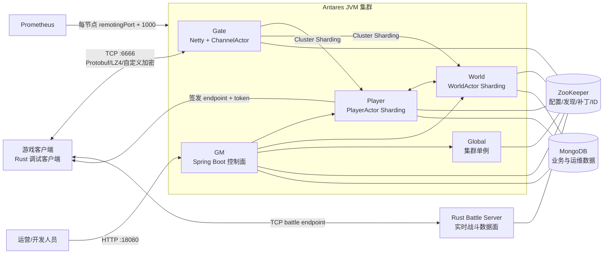

## 3. 技术栈与工程形态

| 领域 | 当前选型 | 作用 |
|---|---|---|
| JVM 与语言 | JDK 21、Kotlin 2.3.21 | 主业务与集群运行时 |
| 服务框架 | Asteria 0.6.9 | Actor、集群、配置、持久化、脚本、热补丁和 GM 基础能力 |
| Actor 集群 | Apache Pekko 1.2.1、Pekko Management 1.2.1 | Remoting、Cluster Sharding、Singleton、Bootstrap、管理探针 |
| 网络接入 | Netty 4.2.12 | 客户端 TCP 长连接与自定义 Pipeline |
| 协议 | Protobuf 4.34.1 | 客户端协议和内部 RPC |
| 持久化 | MongoDB、Spring Data MongoDB、Mongo Coroutine Driver | Actor 数据、聊天和运维数据 |
| 配置中心 | ZooKeeper、Curator | 运行时配置、发布指针、动态监听、补丁和实例发现 |
| 数值配置 | Luban + Excel | 表结构生成、二进制表和配置发布包 |
| GM 后端 | Spring Boot 4.0.6 | HTTP 管理 API、集群管理、脚本和补丁控制 |
| GM 前端 | Vue 3、Vite、Element Plus、Pinia | 独立构建的管理控制台 |
| 战斗服务 | Rust 2024、Tokio、Prost | 独立低延迟战斗服务原型 |
| 可观测性 | Prometheus Simpleclient、Logback | JVM/消息分发指标与日志 |
| 构建 | Gradle 9、KSP、Cargo | JVM 代码生成、打包和 Rust 构建 |
| 部署 | Docker、Kustomize、Kubernetes | 多角色独立容器部署 |

仓库当前约有 254 个 Kotlin 文件、15 个 Rust 文件、15 个 Proto 文件，以及 29 个 GM 前端 TypeScript/Vue 源文件。JVM 和 Rust 使用两个独立构建体系。

## 4. 模块边界

### 4.1 模块职责

| 模块 | 类型 | 主要职责 | 运行形态 |
|---|---|---|---|
| `common` | JVM 库 | 公共运行时、集群启动、配置中心、Mongo、分片常量、广播、时间、补丁、战斗控制抽象 | 被各节点依赖 |
| `config` | JVM 库 | Luban 表模型、加载器、查询组件、校验器和生成代码 | 被运行节点与工具依赖 |
| `client-proto` | JVM 协议库 | 客户端消息、消息 ID、编解码元数据 | Gate、Player、World、客户端构建依赖 |
| `server-proto` | JVM 协议库 | 内部 RPC、实体 ID 元数据、内部消息 ID | 全部 JVM 节点依赖 |
| `gate` | 可执行节点 | TCP 接入、会话 Actor、协议 Pipeline、鉴权状态机、生成式网关路由、连接排空 | 独立 JVM 进程 |
| `player` | 可执行节点 | 玩家分片 Actor、玩家内存态、登录、聊天、战斗授权、玩家侧配置修复 | 独立 JVM 进程，可横向扩容 |
| `world` | 可执行节点 | 世界分片 Actor、账号到玩家映射、在线会话索引、世界广播、世界状态与唤醒 | 独立 JVM 进程，可横向扩容 |
| `global` | 可执行节点 | Worker 与停服协调器等集群单例 | 独立 JVM 进程 |
| `gm` | 可执行节点 | Spring Boot 管理 API、集群代理、配置发布、脚本、补丁、时间和停服控制 | 独立 JVM 进程 |
| `tools` | 工具程序 | 初始化 ZooKeeper 运行配置、发布 Luban 配置包 | CLI / Kubernetes Job |
| `stardust` | 开发启动器 | 从 ZooKeeper 读取本地拓扑，在同一 JVM 启动全部角色 | 仅本地开发 |
| `battle` | Rust Workspace | 战斗实例注册、Token 校验、实时帧处理原型 | 独立 Rust 进程 |
| `client` | Rust 工具 | Lua 驱动的协议调试客户端 | 本地调试工具 |
| `buildSrc` / `build-logic` | 构建基础设施 | 协议、路由、Luban Bridge、脚本和补丁产物生成 | 构建期 |

### 4.2 编译依赖关系

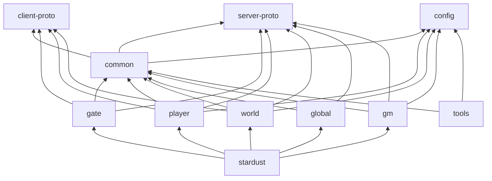

`common` 同时依赖 `config` 和两套协议，因此它不是纯粹的最底层工具库，而是面向 Antares 业务运行时的共享平台层。新增纯通用能力时，应避免继续扩大这个耦合；可以按需要拆分 `common-core`、`common-runtime`、`common-domain-contract`。

## 5. 运行时拓扑与节点启动

### 5.1 节点角色

| 角色 | 本地拓扑示例 | 持有实体/单例 | 主要外部端口 |
|---|---|---|---|
| Player | `player-2333`、`player-2334` | `PlayerActor` 实体 | Remoting；Metrics=`port+1000`；Management=`port+2000` |
| World | `world-2335` | `WorldActor` 实体、World Waker 协调任务 | 同上 |
| Global | `global-2336` | `worker`、`shutdownCoordinator` 单例 | 同上 |
| Gate | `gate-2337` | 每连接一个本地 `ChannelActor` | Remoting、Metrics、Management、客户端 TCP `6666` |
| Gm | `gm-2338` | 分片和单例代理、MonitorActor | Remoting、Metrics、Management、HTTP `18080` |

本地 `stardust` 的实际端口来自 ZooKeeper 中的 `RuntimeNodeConfig`，不是各 `main()` 的默认 CLI 端口。生产容器端口由 `deploy/docker/entrypoint.sh` 和 Kubernetes 环境变量确定。

### 5.2 两种集群发现模式

启动工厂根据环境变量 `CLUSTER_DISCOVERY` 或 `game.cluster.discovery` 选择发现模式：

- `config-center`：从 ZooKeeper 中的拓扑配置解析成员与 Seed，适合本地开发或固定拓扑；
- `kubernetes`：通过 Kubernetes API 和 Pekko Cluster Bootstrap 发现 Pod，ZooKeeper 不再保存集群成员拓扑，但仍承担配置中心等职责。

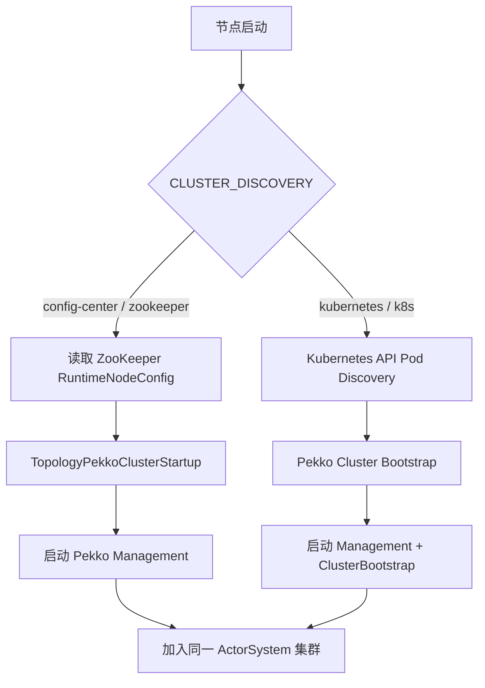

### 5.3 统一启动流水线

所有 JVM 节点都通过 `ClusterNodeBootstrap` 组装 Asteria Application。公共模块的安装顺序体现了依赖关系：先建立指标、配置中心、时间和本地实体表，再安装补丁、Mongo、世界配置、运行态、游戏配置和广播模块，之后才注册节点自身的分片/单例及扩展模块。

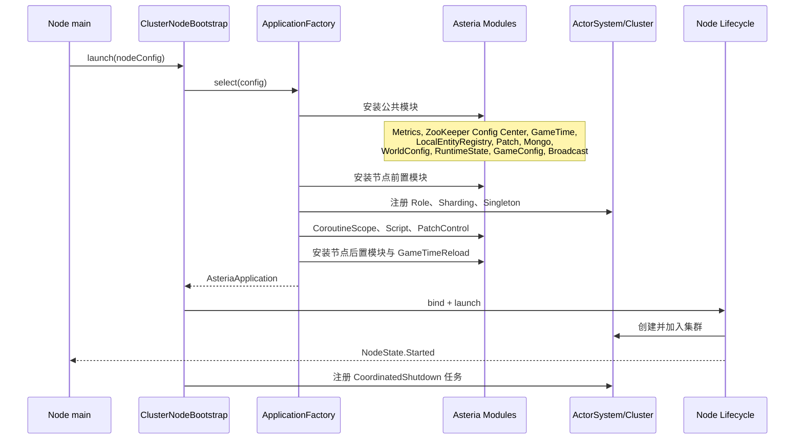

节点状态使用 `Unstarted -> Started -> Stopping -> Stopped`。Gate 进入 `Stopping` 时立即拒绝新连接并开始连接排空。

## 6. Actor、分片与一致性模型

### 6.1 分片实体

系统定义两类核心实体，分片数均为 3000：

- `PlayerActor`：实体 ID 为 `playerId`，只在 Player 角色节点承载；
- `WorldActor`：实体 ID 为 `worldId`，只在 World 角色节点承载。

Gate、Global、GM、Player 和 World 会按调用需要注册对应 ShardRegion 或代理，因此调用方不需要知道实体当前在哪台机器。分片 ID 使用实体 ID 字符串的 `hashCode` 对 3000 取模。Player/World 承载节点使用 `LeastShardAllocationStrategy(1, 3)`，并分别以 `HandoffPlayer`、`HandoffWorld` 完成迁移前排空。

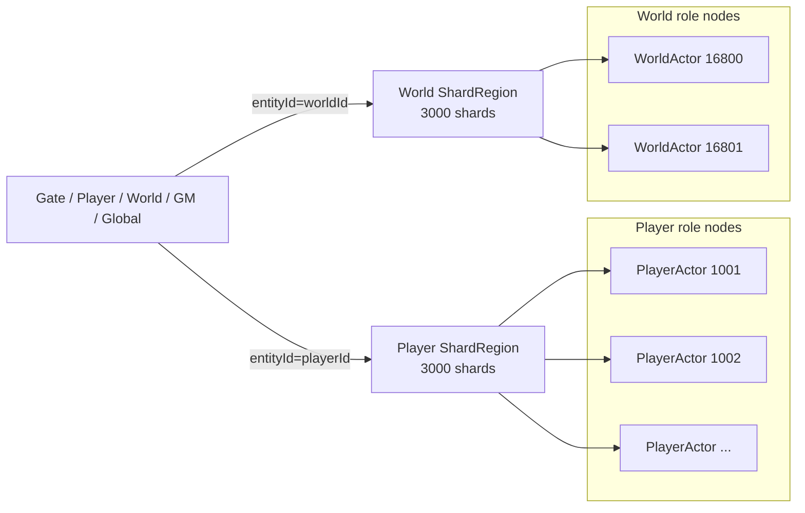

### 6.2 单例与本地 Actor

| Actor | 所属角色 | 形态 | 职责 |
|---|---|---|---|
| `WorkerActor` | Global | Cluster Singleton | 共享工作入口示例 |
| `ShutdownCoordinatorActor` | Global | Cluster Singleton | 分阶段停服协调 |
| `ChannelActor` | Gate | 每 TCP 会话一个本地 Actor | 连接状态、登录状态机、路由、订阅和回包 |
| `PlayerBroadcastActor` | 每个 JVM 节点 | 固定路径本地 Actor + 集群广播路由 | 把跨节点广播转换成本节点 EventBus 发布 |
| `MonitorActor` | GM | 本地 Actor | GM 运行时监控入口 |
| `GateShutdownListenerActor` | Gate | 本地 Actor | 接收全服排空命令 |

### 6.3 Actor 生命周期

Player 和 World 都通过 `ActorLifecycleGate` 把“加载完成前”和“正常运行”分开。业务消息在内存数据未加载完成前不会进入普通业务处理。

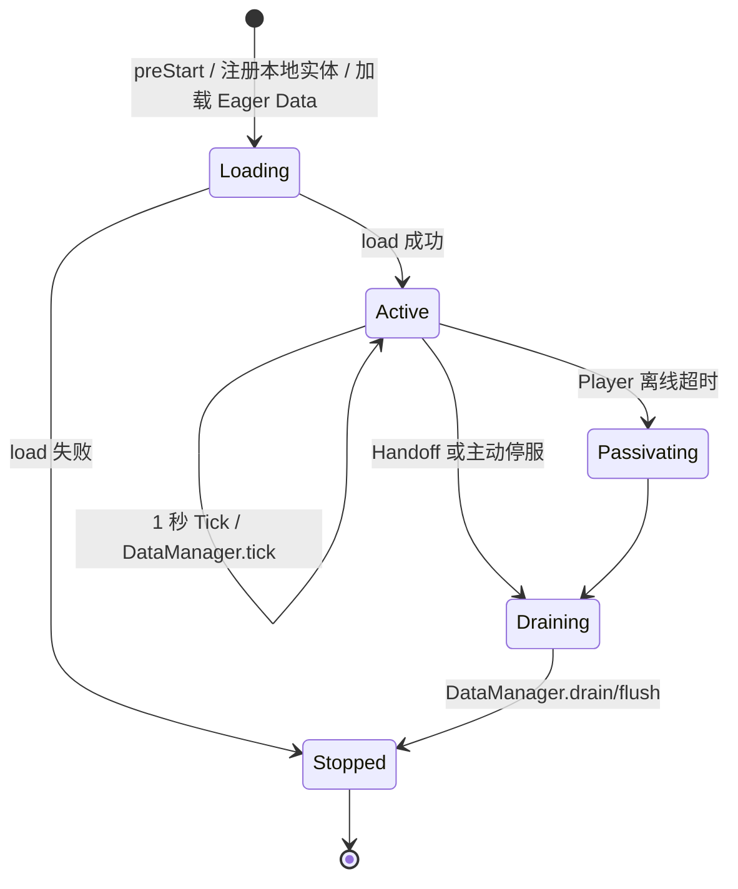

Player 离线一分钟后可被动钝化；在线状态由是否绑定 `channelActor` 判断。World 不依赖空闲钝化，而是由 World Waker 根据动态区服列表主动拉起。

### 6.4 一致性边界

单个玩家或单个世界的普通业务写入都应在对应 Actor 邮箱中完成，这提供了实体内串行一致性。跨 Actor 操作不是事务：当前主要依赖消息、`ask`、幂等处理和最终一致性。

新增业务时遵循以下规则：

1. 玩家权威状态放在 `PlayerActor` 的 MemData 中；
2. 区服级权威状态放在 `WorldActor` 的 MemData 中；
3. 不要从其他线程直接修改 Actor MemData；异步结果应回到 `actor.execute(...)` 或邮箱；
4. 跨玩家、跨世界写入需要定义请求 ID、超时、重试和幂等语义；
5. 需要强原子性的跨实体业务不能只依赖 Actor 消息，应增加事务记录、Saga 或 Outbox。

## 7. 接入层、协议与消息路由

### 7.1 Gate 网络 Pipeline

Gate 从 ZooKeeper 加载节点级或通用 `NettyConfig`，监听 TCP 端口。最大网络帧为 100 KiB。Pipeline 顺序如下：

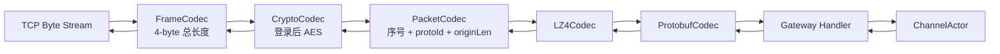

连接建立后，`GateTransportHandler` 创建 `GatewaySession` 和一个 `ChannelActor`。断开时移除排空注册并向 Actor 发送 `StopChannel`。

### 7.2 ChannelActor 状态机

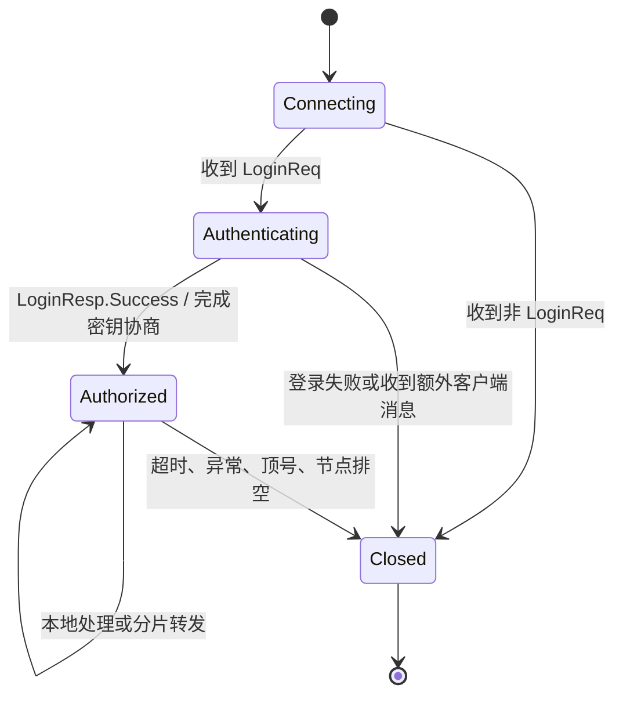

握手使用客户端 X25519 公钥与服务端临时 X25519 密钥计算共享密钥；服务端先把公钥放入成功登录响应，再启用会话 AES。Channel 会记录 `playerId`、`worldId`，后续路由不信任客户端重复提交的实体 ID，而优先从服务端会话属性取值。

### 7.3 登录链路

登录是 World 和 Player 两类实体协作的典型流程。World 持有账号到玩家 ID 的摘要索引，Player 持有完整玩家数据。

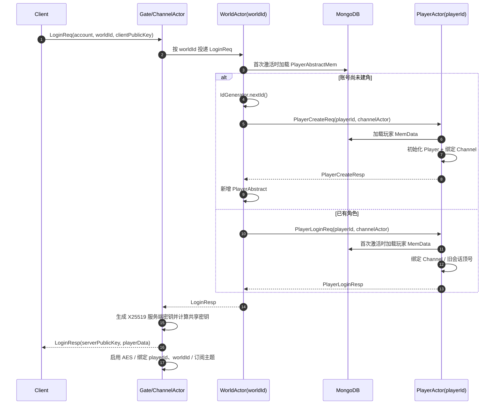

当前创建流程先回成功，再由 Actor 的周期刷盘或排空把 Player 与 PlayerAbstract 持久化。World 到 Player 的创建不是 Mongo 多文档事务；异常恢复依赖 Actor 状态与业务补偿，未来应明确“建角幂等键”和半完成状态修复策略。

### 7.4 普通业务路由

业务 Handler 通过 `@AsteriaGatewayRoute` 声明路由到 `gateway-local`、`player` 或 `world`。构建期聚合 Gate、Player、World 三个模块的路由元数据，生成 `GeneratedGatewayRouting`。

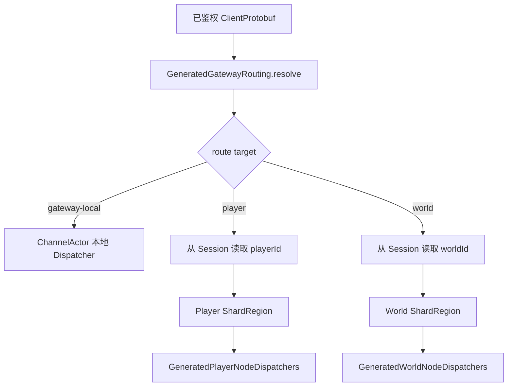

GM 命令复用同一个 `GmReq`，不能完全静态推导目标，因此 Gate 以 `cmd` 映射补充动态路由：`testGm -> PlayerActor`，`testBroadcast -> WorldActor`。

### 7.5 协议分层

| 协议层 | 位置 | ID 范围/注册 | 用途 |
|---|---|---|---|
| 客户端协议 | `client-proto/src/main/proto/client` | `client-proto/protocol/rpc-protocol.json`，当前从 100001 开始 | Client 与 Gate/业务 Actor |
| 内部 RPC | `server-proto/src/main/proto/rpc` | `server-proto/protocol/rpc-protocol.json`，当前从 110001 开始 | JVM 节点与分片 Actor 之间 |
| 本地内部消息 | Kotlin `Message` 标记接口 | 无 Protobuf ID | 单 ActorSystem 内部事件与生命周期消息 |

内部 Proto 可通过 `(asteria.rpc.entity_id)` 指定分片实体字段。`DefaultRpcEntityIdResolver` 对客户端直达消息做显式补充，其他内部消息从生成的协议元数据解析。`RpcEntityIdResolver` 本身是可热替换服务，可在不停机时修正路由字段。

## 8. 持久化设计

### 8.1 数据组织

Player 与 World Actor 各自创建一个 Asteria `DataManager`，把实体 ID、Mongo coroutine client、ReactiveMongoTemplate、GameTime 和 Metrics 注入 `DataScope`。

| Actor | MemData | 典型内容 |
|---|---|---|
| Player | `ActorConfigSyncMem` | 该玩家已应用的配置修复版本 |
| Player | `PlayerMem` | 玩家主档：账号、区服、昵称、等级、联盟、禁言时间 |
| Player | `PlayerActionMem` | 玩家动作/计数状态 |
| Player | `PlayerActivityMem` | 从活动配置派生的玩家活动状态 |
| World | `ActorConfigSyncMem` | 该世界已应用的配置修复版本 |
| World | `PlayerAbstractMem` | `account -> playerId` 的区服内摘要索引 |
| World | `WorldActionMem` | 世界级动作/计数状态 |

聊天历史和离线私聊由 `ChatService` 直接使用 `ReactiveMongoTemplate` 写入独立集合，不经过 Actor DataManager。GM 脚本任务同样使用 Mongo 存储。

### 8.2 加载与刷盘时序

```mermaid
sequenceDiagram
    participant Region as ShardRegion
    participant Actor as Player/World Actor
    participant Lifecycle as ActorLifecycleGate
    participant DM as DataManager
    participant Mongo as MongoDB

    Region->>Actor: 首条实体消息触发激活
    Actor->>Lifecycle: startLoading()
    Lifecycle->>DM: loadEager()
    DM->>Mongo: 按实体 ID 加载各 MemData
    Mongo-->>DM: 历史文档
    DM-->>Lifecycle: 内存态就绪
    Lifecycle-->>Actor: become(active)

    loop 每 1 秒
        Actor->>DM: tick()
        DM->>Mongo: 刷新脏数据/删除标记
    end

    Region->>Actor: Handoff/Passivate/Shutdown
    Actor->>DM: drain() 或 flush()
    DM->>Mongo: 等待未完成写入并持久化
    Actor-->>Region: stop
```

实体类使用 `@AsteriaMongoEntity` 生成 Tracked Wrapper 和 Mongo Helper。内存态通过 Wrapper 捕获字段修改，兼顾严格业务构造器与旧 Mongo 文档缺字段时的兼容加载。

### 8.3 Mongo 初始化

`MongoDbModule` 从 ZooKeeper 的 `/antares/data-source/game` 读取数据源配置，支持 Standalone、ReplicaSet 和 ShardedCluster 参数，启动时可执行：

- 配置合法性校验；
- Ping；
- 必需集合检查；
- 公共及模块级索引创建。

Player/World 在集群模块之前安装各自的 Mongo Index Module，避免业务开始后才发现索引缺失。

### 8.4 一致性与恢复特征

- 单实体内：依靠 Actor 邮箱顺序和单份 MemData，属于强串行、异步持久化；
- Mongo 写入：当前默认可配置 `writeConcern`，Kubernetes 示例使用 `majority`；
- 跨实体：消息驱动最终一致，没有全局事务；
- Actor 迁移：Handoff 先 drain，再在新节点重新加载；
- 进程硬故障：最后一次成功刷盘之后的内存修改可能丢失，恢复点取决于 DataManager 刷盘策略；
- 聊天等旁路写入：失败只记录日志，当前没有 Outbox 或补偿队列。

## 9. 配置体系

系统同时存在三类配置，职责不能混用：

| 类型 | 来源 | 示例 | 变更方式 |
|---|---|---|---|
| 进程静态配置 | HOCON + 环境变量 | 日志、集群发现模式、游戏时区、战斗 Token 参数 | 重启或容器重建 |
| 运行时拓扑/基础配置 | ZooKeeper JSON 节点 | 数据源、Gate 监听、区服列表、游戏时间覆盖 | Tools/GM 写入并监听 |
| 数值配置 | Excel -> Luban -> `game-config.zip` | 物品、怪物、活动、掉落池 | 校验、发布、切换 current 指针、热加载 |

### 9.1 ZooKeeper 路径

| 路径 | 内容 |
|---|---|
| `/antares/data-source/game` | Mongo 数据源 |
| `/antares/netty/{nodeId}` | Gate Netty 监听配置 |
| `/antares/game-worlds/{worldId}` | 区服定义 |
| `/antares/world-runtime-states/{worldId}` | World 心跳与运行状态 |
| `/antares/game-config/...` | 游戏配置发布物、版本与 current 指针 |
| `/antares/game-time/override` | 全局游戏时间偏移与 epoch |
| `/antares/game-time-reload-acks/{epoch}/{nodeId}` | 时间重载确认 |
| `/antares/battle/instances/{instanceId}` | Battle 临时实例注册 |
| `/antares/patches/descriptors` | 热补丁描述 |
| `/antares/patches/revision` | 补丁集合版本 |
| `/antares/patches/artifacts` | 补丁 JAR 二进制 |
| `/antares/worker-ids` | 分布式 ID Worker ID 租约 |

### 9.2 Luban 发布流水线

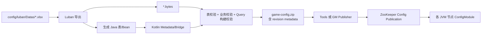

构建期查询组件和校验器通过贡献扫描自动收集。运行节点加载 ZIP 后，会依次反序列化表、构建诸如 `itemsByType`、`monstersBySceneId` 的派生查询，再运行校验器；只有完整成功的 Snapshot 才会成为当前配置。

### 9.3 配置热加载与 Actor 修复

全局 Config Snapshot 的重建和 Actor 本地内存修复是两件事。`ConfigChangeHandler` 只负责后者。

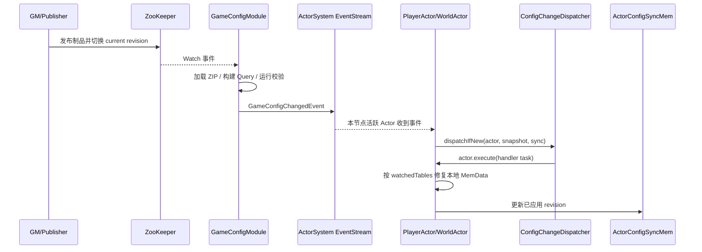

不在线的 Player 不会被配置变更强制全部唤醒；它在下次登录时使用当前 Snapshot 追赶。World 在激活事件中执行同样的追赶。这避免一次配置发布制造全量 Actor 惊群。

### 9.4 可调游戏时间

业务代码通过 Actor 级 `GameTime` 取时间，而不是直接使用系统时钟。有效偏移为“全局偏移 + Actor 本地偏移”。GM 修改全局偏移会增加 epoch，各节点监听后应用偏移并执行 `StartupLikeReloadPlan`：Player/World 停止本机活跃实体，使其按类似重启的路径重新加载；每个节点向 ZooKeeper 写回 ACK。

## 10. 广播与聊天

每个 JVM 节点启动一个固定路径 `/user/broadcastActor`，再通过配置化 `broadcast-group` 形成集群广播路由。World 把 Protobuf 消息包装成 `BroadcastEnvelope(topic, include, exclude, messageId, payload)` 发给路由；各节点的本地 Actor 将其发布到 `PlayerBroadcastEventBus`；Gate 上订阅对应 Topic 的 ChannelActor 最终向客户端写包。

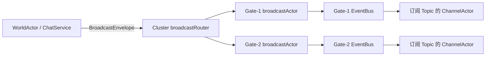

Topic 包括全服、世界、跨服聊天和联盟等。世界/联盟聊天经过 World 广播；私聊直接路由到目标 PlayerActor，目标离线时写入 `offline_private_chat_message`，下次登录最多拉取 100 条并删除。

## 11. Rust 战斗服务

战斗采用控制面与数据面分离：

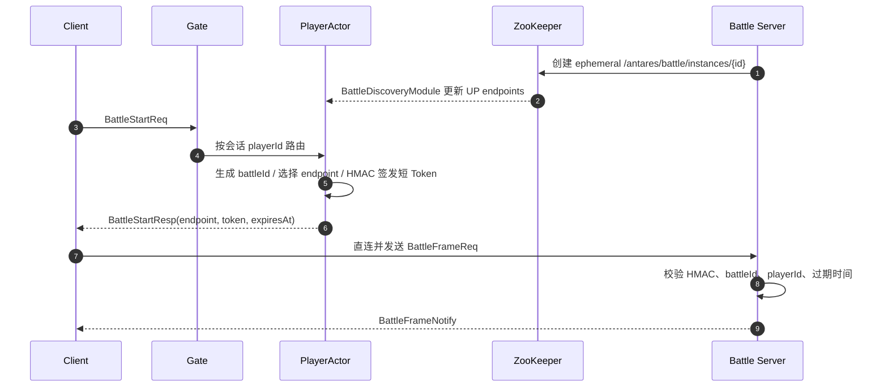

实例选择目前是按 `battleId mod endpointCount` 的稳定取模；动态发现列表优先，静态 HOCON endpoint 是无发现结果时的回退。Token 格式为 `v1.battleId.playerId.expiresAt.signature`，JVM 与 Rust 都使用 HMAC-SHA256。

当前 `battle-server` 仍是原型：它每个 TCP 连接只处理一帧并返回 ACK 计数；战斗状态机、断线重连、帧同步、负载上报、实例排空、结果签名、结果回传和 JVM 结算均未实现。因此 Battle 还不能被视为完整生产链路。

## 12. GM、脚本与热补丁控制面

GM 节点同时加入 Actor 集群并内嵌一个 Spring Boot Servlet 服务。它拥有 Player/World 分片代理和 Global 单例代理，可通过 HTTP 操作集群。

当前工程内显式提供：

- 区服状态与心跳查询；
- 全服停服计划启动/查询；
- 游戏时间覆盖与节点 ACK 查询；
- 数值配置校验、发布、发布并重载、版本提升；
- 脚本设置查询。

Asteria GM Starter 另外提供集群管理、脚本任务、元数据和热补丁端点。`gm/frontend` 是独立 Vue 工程，当前未被 Gradle 或 Dockerfile 自动构建进 GM JAR，需要单独构建/部署或由反向代理托管。

### 12.1 脚本与热补丁的边界

- Groovy/JAR Node Script 与 Actor Script：适合诊断、临时运营动作、短期数据修复；
- Runtime Patch：适合受审计的 Handler/Service 实现替换，支持目标角色、能力约束、版本、应用和禁用；
- 正常版本发布：适合模型、协议、持久化结构和长期业务变更。

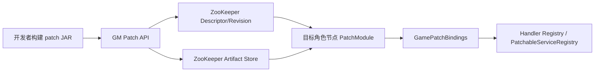

每个业务节点的 `GamePatchBindings` 只暴露允许替换的 Registry，降低补丁随意触达内部对象的范围。补丁产物与主运行 JAR 分离，并通过 `Patch-Class` Manifest 指定入口。

## 13. 优雅停服

Global 角色上的 `ShutdownCoordinatorActor` 是停服状态机。GM 发起计划后，顺序为 Gate 排空、在线 Player 刷盘、World 刷盘，任何阶段失败或超时都会进入 Failed。

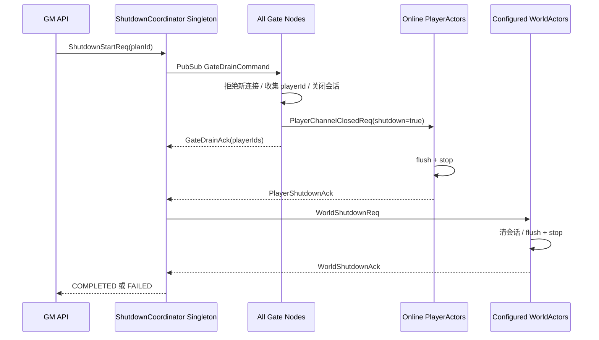

默认超时为 Gate 30 秒、Player 120 秒、World 180 秒。Kubernetes 在发送 SIGTERM 前还执行 20 秒 `preStop`，总终止宽限期 180 秒。需要注意：应用内完整停服最坏时间可能超过 Kubernetes 的 180 秒上限，生产参数必须统一核算，不能直接沿用示例值。

## 14. 部署架构

### 14.1 本地开发

`stardust:prepareLocalDev` 初始化固定 ZooKeeper 拓扑、Mongo/Gate/区服配置和游戏配置；`stardust:run` 在一个 JVM 中按拓扑并发启动 2 个 Player 和 Gate、World、Global、GM 各 1 个节点。`sameJvm=true` 只用于解决同 JVM 多 ActorSystem 的 JMX 配置。

### 14.2 Kubernetes 当前形态

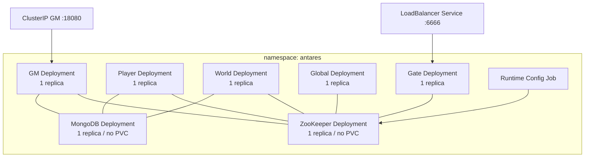

每个角色独立 Deployment，滚动策略为 `maxUnavailable=0`、`maxSurge=1`，带 `/alive` 和 `/ready` 管理探针。Gate 通过 LoadBalancer 暴露，GM 仅 ClusterIP。Player/World 的 JVM Heap 与资源配额高于 Gate/Global/GM。

该目录明确是部署骨架，不是生产高可用方案：ZooKeeper 和 Mongo 是单副本 Deployment、没有持久卷，业务角色也均为单副本。生产环境应替换为托管服务或正确的 StatefulSet/Operator，并把副本数、反亲和、拓扑分散、PDB 和容量基线一起设计。

## 15. 可观测性

每个 JVM 节点在 `remotingPort + 1000` 启动 Prometheus HTTPServer，导出 JVM 默认指标和 Asteria Metrics。消息分发显式记录：

- `antares.message.dispatch.total`；
- `antares.message.dispatch.succeeded.total`；
- `antares.message.dispatch.failed.total`；
- `antares.message.dispatch.duration`。

标签包括角色、Actor 类型、Dispatcher 类型和消息全名。DataManager、Gateway 与路由也获得同一个 Metrics 实例。Pekko Management 端口为 `remotingPort + 2000`，提供集群管理与 Kubernetes 健康探针。

当前 `Tracer` 默认是 `NoopTracer`，仓库未提供 OpenTelemetry、集中日志、告警规则和 Dashboard。World 另有 10 秒一次的运行状态心跳，GM 默认 30 秒判定过期，它用于业务区服状态，不等同于基础设施健康检查。

## 16. 构建期代码生成

Antares 把易错的注册工作前移到构建期：

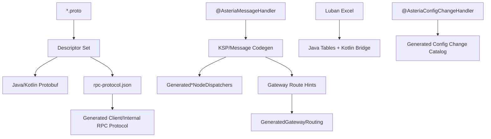

这套机制使缺失 Handler、重复协议 ID、路由元数据错误更容易在编译期暴露。协议 JSON 是生成产物但提交到仓库，变更时应把 Proto、JSON 和生成代码视为同一个评审单元。

## 17. 当前架构的优点

1. **实体边界清晰**：Player 与 World 分开，热点扩容和生命周期管理有明确抓手。
2. **位置透明**：Gate 和业务代码只依赖 ShardRegion，不绑定具体节点。
3. **生成式注册**：协议、Dispatcher、网关路由和配置处理器均在构建期聚合，降低反射与手工注册风险。
4. **数据生命周期完整**：加载、Tick、Handoff、Flush、Drain 已形成统一模式。
5. **控制面相对完整**：配置发布、脚本、补丁、时间覆盖、区服状态和停服均有统一 GM 入口。
6. **开发与生产拓扑分离**：Stardust 明确只服务本地，生产角色独立容器。
7. **战斗旁路方向合理**：低延迟帧不穿过 Gate 和 JVM Actor 邮箱，控制权仍保留在 Player。
8. **动态配置避免惊群**：不活跃 Player 登录时追赶配置，而不是全量唤醒。

## 18. 风险与技术债

以下优先级按“影响 × 发生概率 × 修复前置性”评估。

### 18.1 P0：上线前必须解决

| 风险 | 当前证据 | 影响 | 建议 |
|---|---|---|---|
| GM 默认无鉴权 | `AsteriaGmConfiguration` 使用 `AllowAllGmAuthorizationPolicy`，无请求头时赋予 `local-dev` 身份 | 一旦 GM 被错误暴露，攻击者可执行脚本、补丁、配置和停服操作 | 接入企业 SSO/mTLS，实施 RBAC；默认拒绝；高危操作二次确认和审计；NetworkPolicy 限制来源 |
| Gate 会话加密不满足生产安全 | `Cipher.getInstance("AES")` 通常落到 ECB/PKCS5Padding；没有 AEAD、随机 nonce、服务端身份认证和 HKDF | 可被篡改、重放或中间人攻击；相同明文块泄露模式 | 优先使用 TLS 1.3；若保留应用层加密，使用 X25519 + HKDF + AES-GCM/ChaCha20-Poly1305，并加入握手签名、方向密钥、nonce 和重放窗口 |
| LZ4 解压长度未设上限 | `originLen` 来自网络包并直接用于 `ByteArray(originLen)`，外层只限制压缩帧 100 KiB | 未认证客户端可构造超大长度造成内存拒绝服务 | 在分配前校验 `originLen` 为正且不超过业务上限，并验证压缩比；增加异常计数和连接级限流 |
| 示例基础设施会丢数据 | Kubernetes 中 ZooKeeper/Mongo 均单副本且无 PVC | Pod 重建导致配置、补丁、ID 状态和业务数据丢失 | 生产使用托管 Mongo/ZooKeeper 或有持久化与备份的 Operator/StatefulSet；进行恢复演练 |

### 18.2 P1：生产化关键项

| 风险/缺口 | 影响 | 建议 |
|---|---|---|
| 各业务角色当前仅 1 副本 | 任一 Pod 故障造成角色短时不可用，PDB `minAvailable:1` 还可能阻塞维护 | Player/World/Gate 至少 2 副本，Global/GM 根据 Singleton 与控制面需求设计；增加反亲和和跨区分散 |
| Battle 结算链路未实现 | 战斗结果不能可信回写，无法形成完整业务闭环 | 定义 BattleResult 协议、服务身份、幂等结算 ID、签名、重试/Outbox、超时仲裁和作弊审计 |
| 热补丁二进制放 ZooKeeper | 大 JAR 会放大 ZooKeeper 存储与同步压力 | Descriptor/Revision 留在配置中心，Artifact 迁到对象存储并使用哈希、签名和不可变版本 |
| 停服协调器状态仅在 Singleton 内存中 | Global 故障转移后进行中的停服计划可能丢失 | 把计划、阶段、ACK 和 generation 持久化；新 Singleton 恢复后重放或安全终止 |
| 跨实体流程缺少统一可靠消息模式 | 建角、私聊、战斗结算等在部分失败时需要人工补偿 | 引入业务请求 ID、幂等表、Inbox/Outbox 或 Saga；明确超时与重试矩阵 |
| 应用内停服超时与 K8s grace 不一致 | K8s 可能在 World 排空完成前强杀 JVM | 将 preStop、各阶段 timeout 和 terminationGracePeriod 统一成可计算预算并做故障注入测试 |
| 无分布式追踪 | 跨 Gate、World、Player 的慢请求只能依赖日志拼接 | 接入 OpenTelemetry，传播 request/clientSeq/traceId，给 ask、Mongo 和 Battle 控制链加 Span |
| Battle Workspace 未进入当前 Rust CI | `.github/workflows/rust.yml` 只在 `client` 目录执行 Cargo | 为 `battle` 增加 fmt、clippy、test、release build 和协议兼容检查 |

### 18.3 P2：可维护性与体验

| 问题 | 建议 |
|---|---|
| `GmNode` CLI 默认端口为 2336，与 `WorldNode` 默认值冲突；Docker 为 2337，本地拓扑为 2338 | 统一端口来源并增加启动配置测试；文档只引用明确场景下的端口 |
| LoginResp 的 Client/RPC 枚举转换在 Create/Login Handler 重复 | 下沉为共享 Mapper，减少协议扩展时漏改 |
| GM 前端未纳入主构建和镜像 | 增加前端 CI；选择独立静态站点镜像或打入 GM resources，并明确版本绑定 |
| `common` 聚合了配置、协议、运行时和领域能力 | 随工程增长拆成更小的稳定模块，控制依赖方向 |
| 直接异步 Mongo 写失败仅记日志 | 对需可靠交付的数据增加失败指标、重试、死信和运维补偿入口 |
| 示例配置存在乱码文本 | 统一 UTF-8 生成和校验，CI 中检测替换字符和非法编码 |

## 19. 建议演进架构

演进不需要推翻 Actor + Sharding 主体，重点是补齐安全、可靠消息、生产基础设施和可观测性。

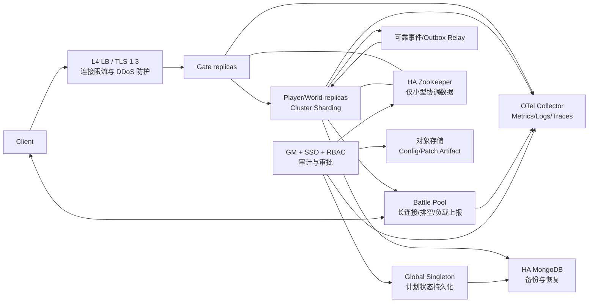

建议分三期推进：

1. **安全与数据底座**：TLS/AEAD、GM 鉴权、解压上限、Secret 管理、Mongo/ZooKeeper 持久化与备份；
2. **高可用与可靠业务**：多副本、反亲和、停服恢复、Outbox/幂等、Battle 结算闭环；
3. **工程效率与可观测性**：OpenTelemetry、SLO/告警、前端和 Battle CI、模块拆分、容量与故障演练。

## 20. 扩展开发指南

### 20.1 新增客户端请求

1. 在 `client-proto` 定义请求/响应并更新消息容器；
2. 在 Player、World 或 Gate 增加 `@AsteriaMessageHandler`；
3. 使用 `@AsteriaGatewayRoute` 声明目标；
4. 不要相信客户端传入的 playerId/worldId，Handler 以 Actor 实体 ID 为准；
5. 重新生成协议 ID、Dispatcher 和 Gateway Routing；
6. 增加路由、权限、幂等和异常响应测试。

### 20.2 新增玩家数据模块

1. 定义 Mongo Entity 与兼容旧文档的 `@PersistenceCreator`；
2. 使用 `@AsteriaMongoEntity` 生成 Tracked Wrapper；
3. 实现 MemData 的加载、索引和业务方法；
4. 注册到 `PlayerDataModules`；
5. 为查询建立模块级索引；
6. 验证新建、旧文档加载、脏字段更新、删除、Handoff 和硬故障恢复。

### 20.3 新增动态配置表

1. 修改 Luban Excel/Schema 并刷新生成代码；
2. 增加查询 Builder 和 Validator；
3. 如果配置影响 Actor 已有内存，增加带 `watchedTables` 的 `ConfigChangeHandler`；
4. Handler 必须幂等，并允许 Actor 跨多个 revision 直接追到最新状态；
5. 通过 validate、package、publish-and-reload 全链路验证。

### 20.4 选择脚本、补丁还是发版

| 场景 | 推荐手段 |
|---|---|
| 查询 Actor 状态、一次性诊断 | Script |
| 小范围、短期数据修复 | 审计后的 Actor/Node Script |
| 紧急替换 Handler/Service 行为 | Runtime Patch |
| 协议、实体结构、依赖或长期逻辑变更 | 正常版本发布 |

## 21. 验收与架构测试建议

当前单元测试覆盖了网关 Codec Round Trip、聊天策略、Mongo 历史兼容、运行时补丁和配置生成等局部能力。建议补充以下架构级测试：

1. 两个 Player、两个 World 节点下的 Shard Rebalance 与 Handoff 数据完整性；
2. 登录创建流程在 World 成功/Player 失败、Player 成功/World 失败时的幂等恢复；
3. 配置发布失败不替换旧 Snapshot，活跃和休眠 Actor 都能最终追赶；
4. Gate 排空、Global 故障转移、Kubernetes 强杀组合下的停服恢复；
5. 非法帧、超大 `originLen`、LZ4 炸弹、重放包和慢连接攻击；
6. Mongo 主从切换、ZooKeeper 会话闪断与 Battle 临时节点消失；
7. Battle Token 跨语言兼容、过期、篡改、重放和 Secret 轮换；
8. 规模化压测：在线 ChannelActor、活跃 PlayerActor、广播扇出、配置热更和全量排空。

## 22. 关键源码索引

| 主题 | 主要文件 |
|---|---|
| 统一节点启动 | `common/.../runtime/GameNodeSupport.kt`、`GameClusterApplicationFactory.kt` |
| ZooKeeper/Kubernetes 集群发现 | `ConfigCenterGameClusterApplicationFactory.kt`、`KubernetesGameClusterApplicationFactory.kt` |
| Gate 启动与网络 | `gate/.../GateNode.kt`、`GateGatewayTransportModule.kt`、`GateNettyPipeline.kt` |
| 会话与鉴权 | `gate/.../ChannelActor.kt`、`GateGatewayRouting.kt` |
| Player 分片与数据 | `player/.../PlayerNode.kt`、`PlayerActor.kt`、`PlayerDataManager.kt` |
| World 分片与数据 | `world/.../WorldNode.kt`、`WorldActor.kt`、`WorldDataManager.kt` |
| 登录链路 | `world/.../PlayerLoginHandler.kt`、`player/.../PlayerCreateReqHandler.kt`、`PlayerLoginReqHandler.kt` |
| 配置热加载 | `common/.../module/GameConfigModule.kt`、`ActorConfigSyncMem.kt` |
| 战斗发现与授权 | `BattleDiscoveryModule.kt`、`BattleControlClient.kt`、`battle-server/src/main.rs` |
| GM 控制面 | `gm/.../GmRuntimeModule.kt`、`GmHttpServer.kt`、`AsteriaGmConfiguration.kt` |
| 优雅停服 | `global/.../ShutdownCoordinatorActor.kt`、`gate/.../GateConnectionDrainer.kt` |
| Kubernetes | `deploy/k8s/game-server.yaml`、`deploy/k8s/config.yaml`、`deploy/k8s/README.md` |
| 构建与生成 | `build.gradle.kts`、各模块 `build.gradle.kts`、`buildSrc`、`build-logic` |

## 23. 结论

Antares 已具备一个可扩展游戏服务器骨架的主体：连接会话、实体分片、Actor 生命周期、Mongo 内存态、动态配置、协议生成、GM、热补丁、优雅停服和战斗旁路之间的边界基本清晰。当前最值得保留的是 Player/World 的一致性模型、生成式路由以及统一节点模块化启动。

它目前更接近“功能完整的工程脚手架和开发验证平台”，还不是可直接承载生产数据的成品。上线前的决定性工作不在继续增加业务 Handler，而在安全接入、GM 权限、基础设施持久化、多副本、跨实体可靠性、Battle 结算闭环和全链路可观测性。完成这些底座后，现有 Actor + Sharding 架构可以继续演进，无需整体重写。
